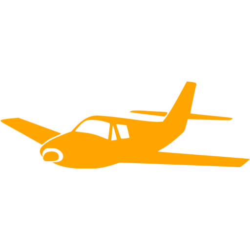

# HackBulgaria Airlines

Discover the world with HackBulgaria Airlines!



We need to collect the needed information for our airline to start working with customers. All data is for one airport!

So lets start with the basic stuff:


## Flight

Make a `Flight` class which can be initialized by that (all constructor arguments are shown in the example below).

```python
f = Flight(date="Bron", start_time=Date(29, 11, 2016, hour='12:20'), end_time=Date(29, 11, 2016, hour='15:30'), passengers=100, max_passengers=120, from_dest="Sofia", to_dest="London", terminal=Terminal(2, 30))
```

Hint: Create class `Date` with date and hour information!

## Terminal

We also need class `Terminal`. Our airport can have more than 1 terminal. Initialize it with:

```python
t = Terminal(number=1, max_flights=20)
```

## Now comes the funny part!

HackBulgaria Airlines need to know a lot of information to work with its customers!

### Flight for date

Implement a method, which returns the flights for a date:

```python
def get_flight_for(date):
    pass
```

### Flight before 'hour'

Implement a method, which returns the flights before 'hour':

```python
def get_flight_before(date, hour):
    pass
```

### Flight from destination

Implement a method, which returns the flights from a destination:

```python
def get_flight_from(destination):
    pass
```

### Flight to destination

Implement a method, which returns the flights to a destination:

```python
def get_flight_to(destination):
    pass
```

### All flights from terminal

Implement a method, which returns the flights from a terminal:

```python
def get_terminal_flights():
    pass
```

### Flights from terminal on date

Implement a method, which returns the flights from a terminal:

```python
def get_terminal_flights_on(date):
    pass
```

### Flight duration

Implement a method, which returns the flight duration.

```python
def flight_duration():
    pass
```

### Flight has empty seats

Implement a method, which returns if there are empty seats in a flight.

```python
def flight_empty_seats():
    pass
```

### All flights to destination from terminal

Method, which returns all flights for a destination from a terminal

```python
def terminal_flights_to_dest():
    pass
```

### All flights with duration less than 'hours' on a 'date'

```python
def flights_on_date_lt_hours(date, hours):
    pass
```

Hint
